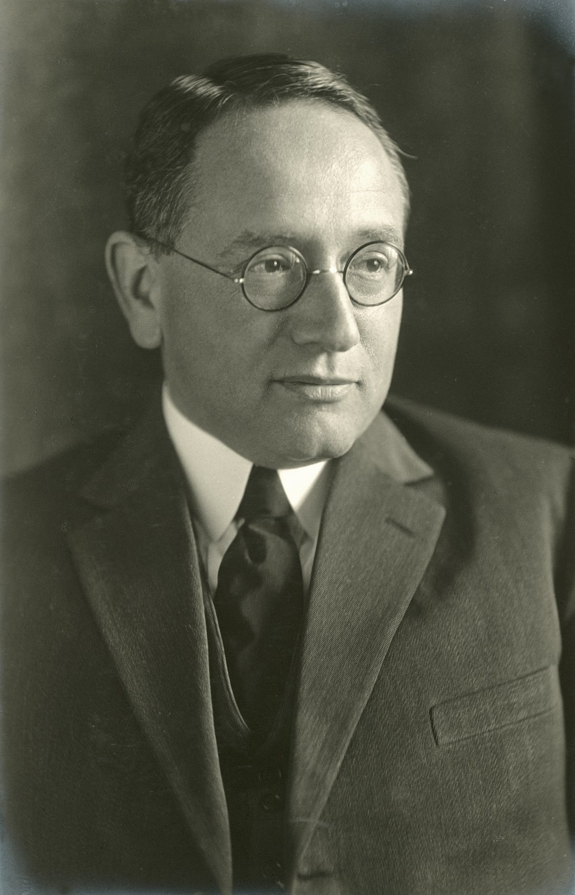

G. Pólya, seorang ahli matematika, memperkenalkan seni pemecahan masalah dengan membagi masalah menjadi beberapa langkah. Di sini saya baru saja **terajari** bagaimana memecahkan masalah menggunakan metode 4 langkah G. Pólya.

## Langkah 1: Pahami masalahnya

Sebelum melangkah lebih jauh untuk menemukan solusi yang mungkin kita gunakan, kita harus memahami masalahnya. Hal ini termasuk merenungkan jawaban dari pertanyaan berikut:

1. Apa kita sudah mengerti semua kata yang digunakan untuk mendeskripsikan masalah tersebut?
    
2. Apa kita sudah memahami apa yang ditanyakan?
    
3. Dapatkah kita menjabarkan masalah dan pertanyaannya dengan gaya bahasa kita?
    
4. Dapatkah kita memvisualisasikan dalam bentuk gambar atau diagram guna membantu kita memahami masalah tersebut?
    
5. Apa kita sudah cukup memiliki informasi untuk mencari jawaban atas masalah tersebut?
    

## Langkah 2: Menyusun rencana

Selanjutnya kita perlu memikirkan rencana terbaik untuk memecahkan masalah tersebut. Ada beberapa strategi yang bisa dipertimbangkan:

### Pendekatan Bottom-Up

Dimulai dari elemen atau komponen kecil atau spesifik, dan secara bertahap digabungkan untuk membentuk sistem yang lebih kompleks.

### Pendekatan Top-Down

Dimulai dari gambaran besar, kemudian secara bertahap dibagi menjadi bagian-bagian kecil dan mendetail.

### Divide and Conqueror

Memecah masalah menjadi sub-masalah yang lebih kecil dan mudah dikelola, dan setiap sub-masalah dipecahkan secara independen, kemudian setiap solusinya digabungkan menjadi solusi keseluruhan dari masalah asli.

### Penyempurnaan Bertahap

Membagi sebuah masalah menjadi semacam langkah-langkah yang mudah dikelola. Selesaikan setiap langkahnya sampai kita menyelesaikan masalah secara keseluruhan.

### Analogi

Membandingkan masalah saat ini dengan masalah yang pernah dipecahkan sebelumnya yang memiliki kesamaan yang penting. Terapkan strategi yang sama dengan pemecahan masalah sebelumnya.

### Pencocokan Pola

Amati pola masalah. Gunakan hasil pengamatan tersebut untuk membangun solusi berdasarkan pola yang sudah dikenal.

## Langkah 3: Melaksanakan Rencana

Setelah memilih strategi pemecahan masalah yang mana, selanjutnya kita perlu menjalankan rencana tersebut. Ada beberapa poin penting yang perlu kita pertimbangkan:

1. Melaksanakan rencana dengan hati-hati dan sabar.
    
2. Memeriksa setiap langkah saat sedang dilakukan.
    
3. Dapat memastikan bahwa langkah yang kita gunakan sudah benar.
    
4. Selama berhasil, bertahan dengan rencana yang kita pilih, tapi jika tidak berhasil, maka buatlah rencana lain.
    

## Langkah 4: Melihat ke Belakang

Setelah melaksanakan rencana, kita perlu melihat masalahnya dan meninjau solusi yang kita temukan. Untuk memutuskan bahwa ini solusi yang tepat, kita perlu mengkonfirmasi dengan menjawab pertanyaan berikut:

* Dapatkah kita memeriksa hasilnya?
    
* Apakah ada cara lain?
    
* Apakah hasil atau metodenya dapat digunakan untuk masalah lain?
    

Merefleksikan keberhasilan dan kegagalan masa lalu dapat membuat kita memprediksi strategi yang mungkin bekerja di lain waktu.